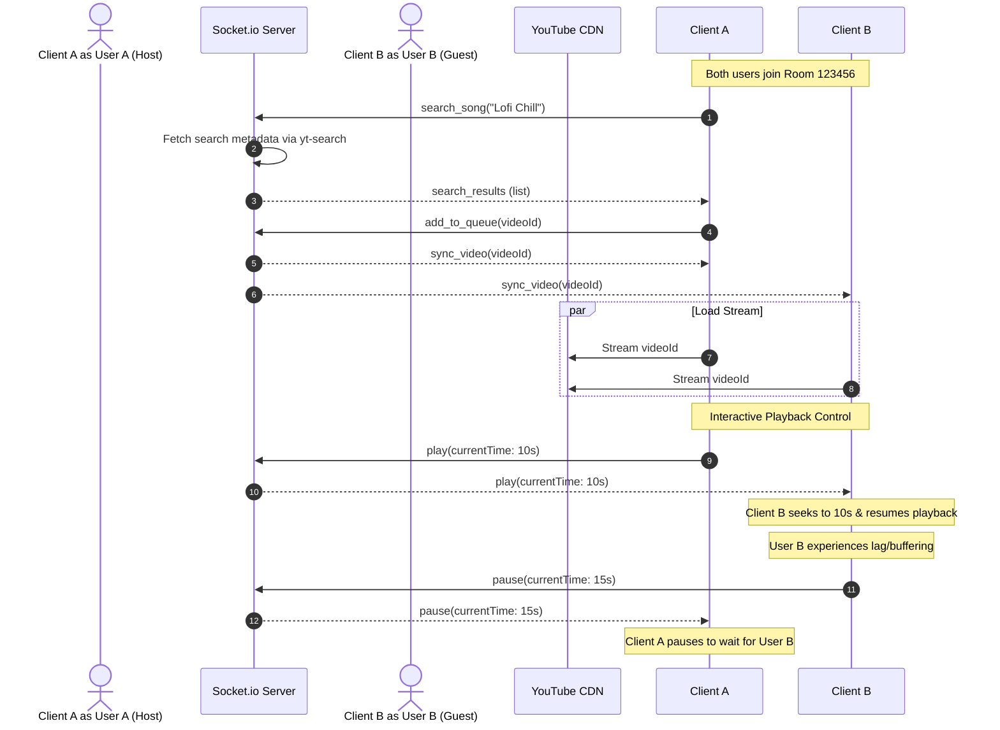

# 🌐 Connect-World (MusicWorld)

Connect-World (also known in-app as **MusicWorld**) is a real-time, fully synchronized collaborative media streaming and room chat application. It allows friends to join virtual rooms, search for videos, manage a shared playlist queue with drag-and-drop re-ordering, and listen/watch together in perfect synchronization.

---

## 🚀 The Problem Connect-World Solves

Listening to music or watching video content online with friends remotely is usually a disjointed experience:
* **The Screenshare Lag:** Screen-sharing software (Discord, Zoom, Teams) compresses video, reduces audio quality, eats up system resources, and introduces noticeable lag.
* **The "3, 2, 1, Play" Sync Fail:** Manually trying to play and pause media at the exact same second over voice chat is nearly impossible and breaks the flow.
* **Network & Buffering Mismatch:** Even if you start together, if one person's internet drops packets or buffers, they immediately fall behind the group.
* **Browser Sandbox Restrictions:** Privacy-focused browsers (like Brave) or standard security settings often block embedded YouTube videos due to cookie restrictions or origin conflicts.

### **The Solution**
Connect-World implements a **state-sync architecture** over WebSockets. Instead of streaming heavy audio/video data from one host to others, it streams only **lightweight control events** (e.g., *play*, *pause*, *seek*, *queue update*). 

Every client loads the media player locally directly from YouTube's CDN, and the backend orchestrates synchronization in real-time. This guarantees **high-fidelity audio, full-resolution video, zero-lag streaming, and ultra-low bandwidth consumption**.

---

## 🌟 Why Connect-World is Superior to Other Solutions

| Feature | Connect-World | Traditional Screen Sharing | Other Sync Sites |
| :--- | :--- | :--- | :--- |
| **Audio/Video Quality** | 💎 **Max Quality** (Direct client-side CDN streaming) | 📉 **Compressed** (Pixel sharing, low bitrate) | 💎 **Max Quality** (Direct client-side CDN streaming) |
| **Bandwidth Usage** | ⚡ **Ultra-Low** (~0 additional bandwidth) | 🔺 **Very High** (Continuous screen upload/download) | ⚡ **Ultra-Low** (~0 additional bandwidth) |
| **Sync Precision** | ⏱️ **Real-time (<500ms deviation)** via WebSockets | ⚠️ **Delayed** (Network transmission latency) | ⚠️ **Variable** (Often relies on client-side polling) |
| **Queue Management** | 🎛️ **Drag & Drop** playlist order updates globally | ❌ **None** (Only the host controls the playlist) | ⚠️ **Static** (Must delete and re-add items) |
| **Privacy / Ad-blocking** | 🔒 **No-Cookie domain implementation** (Works on Brave) | ❌ **Ad-heavy** (Host must run ad-blockers) | ❌ **Breaks** on privacy-focused configurations |
| **Platform Versatility** | 🖥️ **Web App & Standalone Native Desktop (.exe)** | 🌐 Web/App only | 🌐 Web only |
| **Room Lifecycle** | 🔄 **60s Reconnection Grace Period** | ❌ Rooms terminate immediately if host drops | ❌ Varies |

### **Key Advantages In-Detail:**
1. **Brave Browser & Privacy Support:** By forcing the player to use `https://www.youtube-nocookie.com` and matching connection origins, the app bypasses standard iframe embedding issues and third-party cookie blocks.
2. **Resilient Reconnection:** Rooms are held in memory with a 60-second grace period. If a user temporarily loses internet connection or refreshes their browser, the room state is not destroyed. Once they rejoin, the app auto-calculates their position in the song and syncs them up.
3. **Interactive Control Sync:** If user A's video player enters a *buffering* state, the room automatically pauses for user B to keep them in lock-step.
4. **Proxy Search Architecture:** Search queries are routed through a backend yt-search proxy. This protects clients from hitting API quota blocks and prevents cross-origin (CORS) resource issues.

---

## 🛠️ The Technical Stack

Connect-World is built using a modern, decoupled client-server architecture with support for desktop runtime compilation.

### **Frontend (Client)**
* **React 19 & Vite 8:** High-performance, fast-refresh SPA framework.
* **React Router Dom 7 (HashRouter):** Enables seamless routing compatible with Electron's file loading system and GitHub Pages subdirectory hosting.
* **Socket.io Client (v4):** Event-driven client interface for real-time WebSocket communication.
* **React YouTube:** Embedded API player wrapper, optimized with privacy configurations.
* **Vanilla CSS (Glassmorphism & Theming):** Modern CSS custom properties support an immersive dark-mode UI with smooth micro-animations and custom styling. Includes dynamic light/dark mode toggling.

### **Backend (Server)**
* **Node.js & Express 5:** Light, fast web server hosting static resources and exposing utility endpoints.
* **Socket.io Server (v4):** Handles connection handshakes, rooms namespaces, message broadcasting, and synchronization logic.
* **yt-search:** In-memory YouTube scraper library enabling lightning-fast query-to-video results.

### **Desktop App Wrapper**
* **Electron 43 & Electron Builder 26:** Packages the compiled production-ready React client into a standalone Windows native installer (`.exe`) utilizing the NSIS configuration target.

---

## 📐 Architecture & Data Flow



---

## 📂 Project Structure

```text
Connect-World/
├── backend/                  # Node.js WebSocket & Search API Server
│   ├── package.json          # Dependencies: express, socket.io, yt-search, cors
│   └── server.js             # Main server logic, room management & sockets
├── client/                   # React Frontend App
│   ├── electron/             # Electron desktop configuration
│   │   └── main.cjs          # Desktop window management & build targets
│   ├── src/                  # React Application Code
│   │   ├── components/       # Pages and Layout components
│   │   │   ├── LandingPage.jsx  # Room join/creation interface
│   │   │   ├── RoomPage.jsx     # Shared player, Chat room, Queue, Drag-&-Drop
│   │   │   ├── LandingPage.css  # Landing page UI styling
│   │   │   └── RoomPage.css     # Room page UI glassmorphism style rules
│   │   ├── App.jsx           # Routing & configuration
│   │   ├── main.jsx          # Entry point mounting
│   │   └── index.css         # Global variables & theme controls
│   ├── package.json          # Dependencies & build scripts (Vite, Electron, Builders)
│   └── index.html            # Main HTML wrapper
└── README.md                 # Project Overview & documentation
```

---

## 💻 How to Run Locally

### **Prerequisites**
Make sure you have [Node.js](https://nodejs.org/) installed (v18+ recommended).

### **1. Run the Backend Server**
```bash
cd backend
npm install
node server.js
```
The server will start running on `http://localhost:5000`.

### **2. Run the Frontend Web Client**
```bash
cd client
npm install
npm run dev
```
Open `http://localhost:5173` in your browser.

### **3. Run as a Native Desktop App (Electron)**
In a separate terminal inside the `client` directory, run:
```bash
npm run electron:start
```

---

## 📦 Building and Packaging for Production

### **Compile Frontend Web App**
To compile the static React files into `/client/dist`:
```bash
cd client
npm run build
```

### **Build Windows Desktop Installer (.exe)**
To package the app into a standalone installer using electron-builder:
```bash
cd client
npm run electron:build
```
The output `.exe` installer will be located in the `client/dist_electron/` directory (or customized build folder).

### **Deploying to Cloud Host (Render)**
The backend is set up to automatically serve the frontend when compiled.
1. Build the frontend (`npm run build` in `client`).
2. Make sure the server static routes point to the `dist` folder.
3. Deploy the backend folder to Render. It is currently deployed at:
   `https://connect-world-r2tv.onrender.com`

---

## 👨‍💻 About the Developer

Connect-World was designed and engineered by **Aniket Pawar**:
* **Education:** B.Tech in Computer Science and Engineering (2022 - 2026)
* **Background:** Software Engineer specializing in scalable application development, system architecture design, real-time networking protocols, and modern full-stack web technologies.
* **Portfolio:** [aniket0102.github.io/portfolio-2026](https://aniket0102.github.io/portfolio-2026/)
* **LinkedIn:** [linkedin.com/in/aniketpawar25](https://www.linkedin.com/in/aniketpawar25/)
* **GitHub:** [github.com/ANIKET0102](https://github.com/ANIKET0102)

---
*Disclaimer: This project was developed strictly for educational purposes. Connect-World does not host, upload, or own any of the media files streamed through the platform. Playback is entirely powered by YouTube's official embedded API players.*
